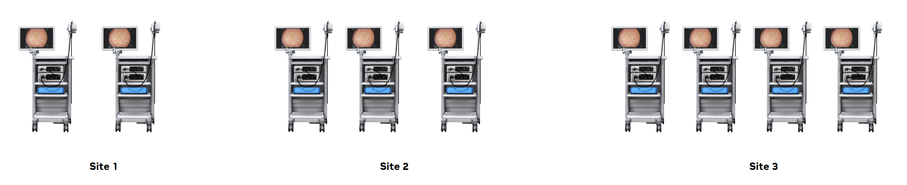

# Holoscan Federated Analytics

This tutorial offers an in-depth guide to Holoscan Federated Analytics, walking you through the step-by-step process of enabling federated analytics for Holoscan applications.

## Table of Contents

- [Holoscan Federated Analytics](#holoscan-federated-analytics)
  - [Table of Contents](#table-of-contents)
  - [Example User Stories for Holoscan Federated Analytics](#example-user-stories-for-holoscan-federated-analytics)
  - [Federated Analytics: A Conceptual Overview](#federated-analytics-a-conceptual-overview)
  - [Federated Analytics for Holoscan: A High-Level Overview](#federated-analytics-for-holoscan-a-high-level-overview)
  - [Introduction to NVFLARE](#introduction-to-nvflare)
    - [NVFLARE Statistics for Federated Analytics](#nvflare-statistics-for-federated-analytics)
  - [Overview of the Holoscan Federated Analytics Architecture](#overview-of-the-holoscan-federated-analytics-architecture)
  - [Enabling Federated Analytics for Holoscan Applications](#enabling-federated-analytics-for-holoscan-applications)
    - [Overview](#overview)
    - [Exploring Holoscan Federated Analytics: A Real-World Example](#exploring-holoscan-federated-analytics-a-real-world-example)
    - [Using Data Exporter API for Data Generation](#using-data-exporter-api-for-data-generation)
    - [Data Analytics with NVIDIA FLARE](#data-analytics-with-nvidia-flare)
    - [NVFLARE for Federated Statistics](#nvflare-for-federated-statistics)
      - [Key Components of NVFLARE involved in Federated Statistics](#key-components-of-nvflare-involved-in-federated-statistics)
        - [Server](#server)
        - [NVFLARE Client](#nvflare-client)
        - [Federated Statistics Workflow](#federated-statistics-workflow)
        - [Configuration Files](#configuration-files)
      - [Example Workflow in Federated Statistics](#example-workflow-in-federated-statistics)
      - [Summary](#summary)
    - [NVFLARE Application for Holoscan Federated Analytics](#nvflare-application-for-holoscan-federated-analytics)
      - [Packaging and Deployment of the Reference Application](#packaging-and-deployment-of-the-reference-application)
      - [Running reference Holoscan NVFLARE application on a distributed system](#running-reference-holoscan-nvflare-application-on-a-distributed-system)
      - [Key Components of NVFLARE Reference Application for Holoscan Federated Analytics](#key-components-of-nvflare-reference-application-for-holoscan-federated-analytics)
      - [Dynamic Provisioning of NVFLARE Clients and Users](#dynamic-provisioning-of-nvflare-clients-and-users)
        - [Adding new clients](#adding-new-clients)
        - [Adding new users](#adding-new-users)
    - [Visualizing Federated Analytics Results](#visualizing-federated-analytics-results)
      - [Backend REST API Service](#backend-rest-api-service)
      - [Visualization Frontend](#visualization-frontend)
  - [Summary](#summary-1)

## Example User Stories for Holoscan Federated Analytics

Here are a few user stories illustrating the needs and benefits of Holoscan Federated Analytics:

- **Optimizing Resource Utilization:** As a Hospital CIO, I want to gather and analyze key metrics from Holoscan applications running on multiple IGX devices, enabling me to optimize software and hardware resource utilization.
- **Informing Product Design:** As a medical device manufacturer, I want to understand usage patterns of scopes, which will inform our design decisions for a lens cleaning solution.
- **Clinical Validation:** As a medical device manufacturer, I want to analyze statistical outcomes from medical procedures performed using Holoscan applications on IGX devices, allowing me to leverage this data for clinical validation of future features.
- **Troubleshooting and Support:** As a system administrator, I want to identify usage patterns and errors reported by Holoscan applications on IGX devices, facilitating efficient troubleshooting and issue resolution.

## Federated Analytics: A Conceptual Overview

Federated Analytics is an approach to user data analytics that combines information from distributed datasets without gathering it at a central location.


<br> Image: Federated Analytics

## Federated Analytics for Holoscan: A High-Level Overview

NVIDIA Holoscan is normally deployed on a fleet of NVIDIA devices.


<br> Image: An Example Holoscan application deployed on a fleet of NVIDIA devices

A key goal of Holoscan Federated Analytics is to provide customers with a robust feature to capture and analyze specific metrics for Holoscan applications that are deployed on a fleet of NVIDIA devices, enabling data-driven insights and decision-making.


<br> Image: Holoscan Federated Analytics

## Introduction to NVFLARE

The Holoscan Federate Analytics is using [NVIDIA FLARE](https://developer.nvidia.com/flare). NVIDIA FLARE is a domain-agnostic, open-source, and extensible SDK. FLARE serves as a federated computing framework, with applications such as Federated Learning and Federated Analytics. FLARE supports federated statistics where FLARE provides built-in federated statistics operators (controller and executors) that can generate global statistics based on local client side statistics.

### NVFLARE Statistics for Federated Analytics

At each client site, we could generate one or more datasets; each dataset may have many features. For each feature in the dataset, NVFLARE clients will calculate the local statistics and then NVFLARE server will combine them to produce global statistics for all the numeric features. The output would be a complete statistics for all datasets in clients and global.


<br> Image: Example data flow in NVIDIA FLARE

## Overview of the Holoscan Federated Analytics Architecture

The following diagram illustrates the high-level architecture of Holoscan Federated Analytics:


<br>Image: Holoscan Federated Analytics: Architecture


**Components and Data Flow**

- At the edge, a fleet of Holoscan-enabled NVIDIA IGX devices run separate instances of the Holoscan application, generating local datasets.
- Each device has an NVFLARE client that processes local data and computes local statistics.
- The NVFLARE server communicates with all NVFLARE clients to collect local statistics.
- These statistics are then aggregated to provide global statistics, providing a comprehensive view of the data.

**Data Aggregation and Visualization**

- A REST API service and a UI frontend are provided to visualize these statistics in a web browser, enabling users to easily access and interpret the data.


## Enabling Federated Analytics for Holoscan Applications

### Overview

The following are the primary components that constitute Holoscan Federated Analytics:
- **Data Generation:** The Holoscan SDK has been enhanced with the Data Exporter API to facilitate data generation.
- **Data Analytics:** NVIDIA FLARE is utilized for data analytics, enabling the analysis of generated data.
- **Data Post-Processing:** Backend REST API and UI components are provided for visualizing analytics results, making it easier to extract insights from the data.

Each of these components will be explored in greater detail in the subsequent sections, providing a comprehensive understanding of Holoscan Federated Analytics.

### Exploring Holoscan Federated Analytics: A Real-World Example

This section provides a real-world example of how to use Holoscan Federated Analytics, helping you to better understand its features and functionality.

To illustrate how federated analytics works, let's consider a practical example using the Holoscan endoscopy application. This application analyzes video frames to classify whether they belong to an inside-body or outside-body scenario, providing a confidence score for each output.


<br> Image: Endoscopy Out of Body Detection


<br> Image: Sample input frames and output for Endoscopy Out of Body Detection

**Scenario: Federated Analytics for Edge Devices**

Imagine deploying this application on a fleet of IGX devices, where each device processes video frames and generates local results. However, we're interested in gaining a comprehensive understanding of the application's performance across the entire fleet, rather than just individual device outputs.

**Federated Analytics to the Rescue**

This is where federated analytics comes in. By leveraging federated analytics, we can aggregate local results from each device to obtain global statistics, including:
- Count
- Sum
- Mean
- Variance
- Standard deviation
- Histograms for each feature

These global statistics provide valuable insights into the application's overall performance and behavior, enabling us to make data-driven decisions and optimizations.

### Using Data Exporter API for Data Generation

We provide the Data Exporter API in the Holoscan SDK. It allows applications to generate data that's compatible with analytics applications.

The new Data Exporter C++ API (`DataExporter` and `CsvDataExporter`) is now available. This API can be used to export output from Holoscan applications to comma separated value (CSV) files for Holoscan Federated Analytics applications. `DataExporter` is a base class to support exporting Holoscan application output in different formats. `CsvDataExporter` is a class derived from `DataExporter` to support exporting Holoscan application output to CSV files.

The data root directory can be specified using the environment variable `HOLOSCAN_ANALYTICS_DATA_DIRECTORY`. If not specified, it defaults to the current directory. The data file name can be specified using the environment variable `HOLOSCAN_ANALYTICS_DATA_FILE_NAME`. If not specified, it defaults to the name data.csv. All the generated data will be stored inside a directory with the same name as the application name that is passed to the `DataExporter` constructor. On each run, a new directory inside the `<root_dir>\<app_dir>\` will be created and a new data file will be created inside it. Each new data directory will be named with the current timestamp. This timestamp convention prevents a given run of the application from overwriting any data stored previously by an earlier run of that same application.

**Sample usage of the API**
```c++
// Include Header
#include <holoscan/core/analytics/csv_data_exporter.hpp>

// Define CsvDataExporter member variable
CsvDataExporter exporter

// Initialize CsvDataExporter
exporter("app_name", std::vector<std::string>({"column1", "column2", "column3"}))

// Export data (typically called within an Operator::compute method)
exporter.export_data(std::vector<std::string>({"value1", "value2", "value3"}))
```

**Using Data Exporter API with DataProcessor**

The Holoscan applications like **Endoscopy Out of Body Detection** uses Inference Processor operator (`InferenceProcessorOp`) to output the binary classification results. The `DataProcessor` class used by the inference processor operator (`InferenceProcessorOp`) is now updated to support writing output to CSV files which can then be used as input to analytics applications. Also any other application using `InferenceProcessorOp` can now export the binary classification output to the CSV files.

Below is an example application config using the new export operation:

```yaml
inference_processor_op:
  process_operations:
    "out_of_body_inferred": ["export_binary_classification_to_csv,
                              out_of_body_detection,
                              In-body,
                              Out-of-body,
                              ConfidenceScore"]
  in_tensor_names: ["out_of_body_inferred"]
```

This will create a folder named `out_of_body_detection` in the specified root directory, creates another folder inside it with current timestamp on each run, and creates a .csv file with specified name and three columns - `In-body`, `Out-of-body`, and `Confidence Score`. The lines in the data.csv file will look like:

```
    In-body,Out-of-body,Confidence Score
    1,0,0.972435
    1,0,0.90207
    1,0,0.897973
    0,1,0.939281
    0,1,0.948691
    0,1,0.94994
```

**Enabling data generation for Endoscopy out of Body Detection application**

The [Endoscopy Out of Body Detection](https://github.com/nvidia-holoscan/holohub/tree/main/applications/endoscopy_out_of_body_detection) application supports exporting output to the comma separated value (CSV) files. This data can later be used by analytics applications. The analytics data generation can be enabled by setting `enable_analytics` flag in the config file `<build_dir>/applications/endoscopy_out_of_body_detection/endoscopy_out_of_body_detection.yaml` to `true`.

With this setup, every time you run the Endoscopy Out of Body Detetction application, it will automatically generate separate CSV files for each run. These files can then be used as input for analytics applications, enabling you to gain valuable insights.

**Building and running Endoscopy Out of Body Detection application**

```bash
    # 1. Clone Holohub source.

    git clone git@github.com:nvidia-holoscan/holohub.git
    cd holohub

    # 2. Create a directory to store the Holoscan application generated output, this will later be used as input to the NVFLARE application.
    # Example directory:
    mkdir /media/m2/holoscan_data

    # Build Holohub dev container
    ./dev_container build

    # 3. Launch dev container. While launching we also need to mount the earlier created directory to persist the generated Holoscan application output.
    ./dev_container launch --docker_opts "-v /media/m2/holoscan_data:/workspace/holoscan_data"

    # 4. Set the `HOLOSCAN_ANALYTICS_DATA_DIRECTORY` to `/workspace/holoscan_data`
    export HOLOSCAN_ANALYTICS_DATA_DIRECTORY=/workspace/holoscan_data

    # 5. Build endoscopy out of body detection application.
    ./run build endoscopy_out_of_body_detection

    # 6. Enable analytics data generation by setting `enable_analytics` flag in the config file <build_dir>/applications/endoscopy_out_of_body_detection/endoscopy_out_of_body_detection.yaml to `true`.

    # 7. Run endoscopy out of body detection application.
    ./run launch endoscopy_out_of_body_detection
    # (This may take some time, output will be in a CSV file instead of printing it on the screen.)

    # The Holohub container can be exited now as the data generation is done.
```

Now that we've generated analytics-compatible data, let's move on to the next step: leveraging NVIDIA FLARE to perform data analytics and unlock the full potential of our data.

**Note:** The data generated by individual Holoscan application instances is stored locally on the device where the app is running. In the next sections, we'll dive into how analytics applications can tap into this data and extract meaningful insights from it.

### Data Analytics with NVIDIA FLARE

Now that we're ready to move on to the analytics part of our Holoscan Federated Analytics solution, let's take a closer look at NVIDIA FLARE, the engine that drives our data analytics. In this section, we'll explore the architecture of NVIDIA FLARE and demonstrate how to write a NVIDIA FLARE application that generates actionable insights from our data.

### NVFLARE for Federated Statistics

NVIDIA FLARE (NVIDIA Federated Learning Application Runtime Environment) is a robust framework designed to facilitate federated learning and federated statistics. It allows multiple institutions to collaboratively compute statistical measures on distributed datasets without centralizing the data. This approach ensures data privacy and security while enabling the generation of aggregated statistical insights.

#### Key Components of NVFLARE involved in Federated Statistics

##### Server

The server is the central coordinating entity in the federated statistics workflow.

- **NVFLARE Admin Server**

    It manages control operations, such as starting, stopping, and monitoring the federated statistics process.

- **NVFLARE App Server**

    It orchestrates the aggregation of statistical results from multiple clients, ensuring that global statistical measures are computed correctly.

##### NVFLARE Client

Clients are the participants that perform local statistical computations on their datasets.

- **Local Statistician:** The component responsible for calculating local statistical measures such as mean, variance, and standard deviation on the client’s dataset.

- **Communicator:** Handles the communication between the client and the server, including sending local statistical results to the server and receiving aggregated statistics.

##### Federated Statistics Workflow

The workflow defines the process and sequence of tasks for federated statistics computation.

- **Statistics Workflow:** Specifies the steps involved in computing and aggregating statistics, including local computation and aggregation tasks.

- **Task Definitions:** Detailed definitions of specific tasks, such as computing local statistics and aggregating results, which are executed during the workflow.

##### Configuration Files

Configuration files define the settings and parameters for the federated statistics application.

- **Server Configuration:** Contains settings related to the server’s role, such as aggregation methods and communication protocols.

- **Client Configuration:** Specifies parameters for the client’s local computations, including the statistical measures to compute.

- **Workflow Configuration:** Describes the sequence of tasks in the federated statistics workflow and their respective parameters.

#### Example Workflow in Federated Statistics

- **Initialization:** Clients and server initialize the federated learning environment.

- **Local Computation:** Each client computes local statistical measures (e.g., count, mean, variance) on its own data.

- **Communication:** Clients send their local statistics to the server.

- **Aggregation:** The server aggregates the local statistics into global statistics.

- **Distribution:** The server sends the aggregated statistics back to the clients.

- **Evaluation:** Clients may perform local evaluation of the aggregated statistics.

#### Summary

NVFLARE in the context of federated statistics provides a comprehensive framework for securely and collaboratively computing statistical measures across distributed datasets. By leveraging its key components—server, client, federated statistics workflow, configuration files, data management, security and privacy, logging and monitoring, and extensibility—NVFLARE ensures a robust, secure, and flexible platform for federated statistics applications.

### NVFLARE Application for Holoscan Federated Analytics

To recap, an NVFLARE application for Holoscan Federated Analytics typically consists of one NVFLARE Server, one Admin Server, and one or more NVFLARE Clients, as illustrated in the [high-level architecture](#overview-of-the-holoscan-federated-analytics-architecture) diagram. To illustrate this setup, consider a scenario where N NVIDIA devices are running N separate instances of a Holoscan application with analytics capabilities. In this case, we would have 1 NVFLARE Server, 1 NVFLARE Admin, and N NVFLARE Clients, with each client running on a separate device and the server potentially running on a separate device or one of the existing devices.

A reference NVFLARE application for Holoscan is provided in a [separate repository](https://github.com/nvidia-holoscan/holoscan-federated-analytics/tree/main/applications/holoscan_nvflare_app). This application can be used as is or a starting point for your use case.

This is the NVFLARE application for generating global statistics using the data generated by each configured Holoscan application instance as input.

It mainly consists of:
- Client configuration that specifies the script details to generate local statistics and other related parameters.
- Server configuration that specifies the metrics that need to be calculated, scripts that aggregate the local statistics and the other related parameters.
- All the custom scripts. This application supports hierarchical statistics. A json file defining the hierarchy can be provided and the file name needs to be specified in the server configuration file. The global statistics output generated by the NVFLARE will have global statistics as well as the aggregated statistics at each hierarchical level.

#### Packaging and Deployment of the Reference Application

The reference application is currently configured to have two NVFLARE clients named `Holoscan-Device-1` and `Holoscan-Device-2` and the NVFlare Server named `holoscan.nvflare.sever`. The admin user is configured as `holoscan_admin@nvidia.com`.

The startup kits for NVFLARE Clients and Server are packaged inside a docker container. Deploying NVFLARE clients needs building a docker container on that device and running it. Same needs to be done for running the NVFLARE server. More details are provided in below section and also in the [README](https://github.com/nvidia-holoscan/holoscan-federated-analytics/blob/main/applications/holoscan_nvflare_app/README.md).

To build a NVFLARE docker image and run server/client/admin containers, a script [dev_container](https://github.com/nvidia-holoscan/holoscan-federated-analytics/blob/main/applications/holoscan_nvflare_app/dev_container) is provided.

NVFLARE provisioning tool is used to create the startup kits for server, clients and admin. If more NVFLARE clients are required to be added, NVFLARE provisioning tool can be used to add it to the existing configuration. 

A convenient script, [nvflare_provision](https://github.com/nvidia-holoscan/holoscan-federated-analytics/blob/main/applications/holoscan_nvflare_app/nvflare_provision), is available for dynamic provisioning of NVFLARE clients.

#### Running reference Holoscan NVFLARE application on a distributed system

In real-world deployment, Holoscan applications will execute on NVIDIA devices in a fleet, enabling federated statistics generation by collecting and aggregating local statistics from each device to produce comprehensive overall statistics. To achieve this in a distributed system, follow these step-by-step instructions to deploy the NVFLARE application.

The sample configuration outlined below provides a comprehensive guide to running an end-to-end application.

**IGX 1**: -- Holoscan Applications Instance 1 -- NVFLARE Server -- NVFLARE Client 1 -- NVFLARE Admin

**IGX 2**: -- Holoscan Applications Instance 2 -- NVFLARE Client 2

```bash
 # Steps to be followed on IGX 1

    # 1. Follow steps mentioned earlier to get, build and run the endoscopy out of body detection application.
    #    Additionally `count` parameter in `analytics_replayer` section in the application config can be
    #    modified to differentiate the output of applications running on different devices.

    # 2. Get the Holoscan Federated Analytics Source
    git clone git@github.com:nvidia-holoscan/holoscan-federated-analytics.git

    # 3. Build NVFLARE dev container
    ./dev_container build

    # 4. Edit `/etc/hosts` to map NVFLARE server name to holoscan.nvflare.sever, add below entry to `/etc/hosts`
    <IGX1 IP>   holoscan.nvflare.server

    # 5. Create a directory to store NVFLARE output, below is one example path
    mkdir -p /media/m2/output/<application_name, e.g., out_of_body_detection>

    # 6. Run NVFLARE server container in first terminal as below
    ./dev_container run --server holoscan.nvflare.server --data /media/m2/output/<application_name, e.g., out_of_body_detection>

    # 7. Once inside the container, start the NVFLARE server
    ./start.sh

    # 8. Open another terminal and run the first NVFLARE client container, specify directory from where to read the input (output of Holoscan app)
    ./dev_container run --client Holoscan-Device-1 --data /media/m2/holoscan_data

    # 9. Once inside the container, start the first NVFLARE client
    ./start.sh

    # 10. Start admin container
    ./dev_container run --admin holoscan_admin@nvidia.com


    # Steps to be followed on IGX 2

    # 1. Follow steps mentioned earlier to get, build and run the endoscopy out of body detection application.
    #    Additionally `count` parameter in `analytics_replayer` section in the application config can be
    #    modified to differentiate the output of applications running on different devices.

    # 2. Get the Holoscan Federated Analytics Source
    git clone git@github.com:nvidia-holoscan/holoscan-federated-analytics.git

    # 3. Build NVFLARE dev container
    ./dev_container build

    # 4. Edit `/etc/hosts` to map NVFLARE server name to holoscan.nvflare.sever, add below entry to `/etc/hosts`
    # Note: NVFLARE server is now running on IGX 1, so the IP of IGX 1 should be used here for the mapping.
    <IGX1 IP>   holoscan.nvflare.server

    # 5. Run the second NVFLARE client container, specify directory from where to read the input (output of Holoscan app)
    # Note: Server, first client and admin are running on IGX 1
    ./dev_container run --client Holoscan-Device-1 --data /media/m2/holoscan_data

    # 6. Once inside the container, start the second NVFLARE client
    ./start.sh

    # 7. Once the client 2 is started, switch back to IGX 1 again and follow the below steps.


    # Remaining steps to be followed on IGX 1

    # 1. Switch to the admin container terminal and submit the Holoscan federated analytics job inside the admin container to get the global statistics.
    python3 ./submit_job.py

    # Once the job is finished, all the containers can be exited.
    # The global statistics output will be available in the specified output directory (`/media/m2/output/<application_name, e.g., out_of_body_detection>`) on IGX 1 as the server is running on IGX 1.
    # On each run, the directory with the current timestamp will be created and a global statistics JSON file will be created inside it.
```

Now that we have generated the global statistics output, let's look at the different key components of the NVFLARE application for Holoscan Federated Analytics and how they can be modified as per your needs.

#### Key Components of NVFLARE Reference Application for Holoscan Federated Analytics

[Here](https://github.com/nvidia-holoscan/holoscan-federated-analytics/tree/main/applications/holoscan_nvflare_app) is the main source of this reference application as we have seen earlier. It mainly has:

- A [README.md](https://github.com/nvidia-holoscan/holoscan-federated-analytics/blob/main/applications/holoscan_nvflare_app/README.md) providing all the details about the application.
- [dev_container](https://github.com/nvidia-holoscan/holoscan-federated-analytics/blob/main/applications/holoscan_nvflare_app/dev_container) - A script to build and run NVFLARE docker containers.
- [nvflare_provision](https://github.com/nvidia-holoscan/holoscan-federated-analytics/blob/main/applications/holoscan_nvflare_app/nvflare_provision) - A script for dynamic provisioning of NVFLARE components.
- [workspace/holoscan_federated_analytics/prod_00](https://github.com/nvidia-holoscan/holoscan-federated-analytics/blob/main/applications/holoscan_nvflare_app/workspace/holoscan_federated_analytics/prod_00/) - NVFLARE startup kits for the reference application.
  - [workspace/holoscan_federated_analytics/prod_00/Holoscan-Device-1/](https://github.com/nvidia-holoscan/holoscan-federated-analytics/blob/main/applications/holoscan_nvflare_app/workspace/holoscan_federated_analytics/prod_00/Holoscan-Device-1/) - A startup kit for the NVFLARE client named `Holoscan-Device-1`.
  - [workspace/holoscan_federated_analytics/prod_00/Holoscan-Device-2/](https://github.com/nvidia-holoscan/holoscan-federated-analytics/blob/main/applications/holoscan_nvflare_app/workspace/holoscan_federated_analytics/prod_00/Holoscan-Device-2/) - A startup kit for the NVFLARE client named `Holoscan-Device-2`.
  - [workspace/holoscan_federated_analytics/prod_00/holoscan.nvflare.server/](https://github.com/nvidia-holoscan/holoscan-federated-analytics/blob/main/applications/holoscan_nvflare_app/workspace/holoscan_federated_analytics/prod_00/holoscan.nvflare.server/) - A startup kit for the NVFLARE server.
  - [workspace/holoscan_federated_analytics/prod_00/holoscan_admin@nvidia.com/](https://github.com/nvidia-holoscan/holoscan-federated-analytics/blob/main/applications/holoscan_nvflare_app/workspace/holoscan_federated_analytics/prod_00/holoscan_admin@nvidia.com/) - A startup kit for the NVFLARE admin.
    - [workspace/holoscan_federated_analytics/prod_00/holoscan_admin@nvidia.com/submit_job.py](https://github.com/nvidia-holoscan/holoscan-federated-analytics/blob/main/applications/holoscan_nvflare_app/workspace/holoscan_federated_analytics/prod_00/holoscan_admin@nvidia.com/submit_job.py) - A script to submit the federated statistics job.
    - [workspace/holoscan_federated_analytics/prod_00/holoscan_admin@nvidia.com/transfer/holoscan_fl_example/app/config/config_fed_client.json](https://github.com/nvidia-holoscan/holoscan-federated-analytics/blob/main/applications/holoscan_nvflare_app/workspace/holoscan_federated_analytics/prod_00/holoscan_admin%40nvidia.com/transfer/holoscan_fl_example/app/config/config_fed_client.json) - This is the NVFLARE client configuration file. Below is the configuration file for easy reference:
        ```json
            {
                "format_version": 2,
                "executors": [
                    {
                    "tasks": [
                        "fed_stats_pre_run" ,"fed_stats"
                    ],
                    "executor": {
                        "id": "Executor",
                        "path": "nvflare.app_common.executors.statistics.statistics_executor.StatisticsExecutor",
                        "args": {
                        "generator_id": "holoscan_fl_example_stats_generator"
                        }
                    }
                    }
                ],
                "task_result_filters": [],
                "task_data_filters": [],
                "components": [
                    {
                    "id": "holoscan_fl_example_stats_generator",
                    "path": "holoscan_statistics.HoloscanExampleStatistics",
                    "args": {
                        "data_path": "/workspace/holoscan_data"
                    }
                    }
                ]
            }
        ```
        This config specifies thate `StatisticsExecutor` should be used as a executor. `StatisticsExecutor` is client-side executor that perform local statistics generation and communication to NVFLARE Server global statistics controller. The actual local statistics calculation would delegate to Statistics spec implementer.

        `HoloscanExampleStatistics` specified is the local statistics generator that implements NVFLARE Statistics spec. It basically tells how to calculate local statistics like `count`, `mean`, `std`, `min`, `max`, etc for the given Holoscan data.

    - [workspace/holoscan_federated_analytics/prod_00/holoscan_admin@nvidia.com/transfer/holoscan_fl_example/app/config/config_fed_server.json](https://github.com/nvidia-holoscan/holoscan-federated-analytics/blob/main/applications/holoscan_nvflare_app/workspace/holoscan_federated_analytics/prod_00/holoscan_admin%40nvidia.com/transfer/holoscan_fl_example/app/config/config_fed_server.json) - This is the NVFLARE server configuration file. Below is the configuration file for easy reference:
        ```json
                {
                "format_version": 2,
                "workflows": [
                    {
                        "id": "fed_stats_controller",
                        "path": "nvflare.app_common.workflows.hierarchical_statistics_controller.HierarchicalStatisticsController",
                        "args": {
                            "statistic_configs": {
                                "count": {},
                                "sum": {},
                                "max": {},
                                "min": {},
                                "mean": {},
                                "var": {},
                                "stddev": {},
                                "histogram": {
                                    "*": {
                                        "bins": 2,
                                        "range": [
                                            0,
                                            1
                                        ]
                                    },
                                    "Confidence Score": {
                                        "bins": 5,
                                        "range": [
                                            0.5,
                                            1
                                        ]
                                    }
                                }
                            },
                            "writer_id": "stats_writer",
                            "enable_pre_run_task": false,
                            "precision": 4,
                            "hierarchy_config": "device_map_2.json"
                        }
                    }
                ],
                "components": [
                    {
                        "id": "stats_writer",
                        "path": "holoscan_stats_writer.HoloscanStatsWriter",
                        "args": {
                            "output_path": "/workspace/nvflare_data/",
                            "output_file_name": "nvflare_output.json",
                            "json_encoder_path": "nvflare.app_common.utils.json_utils.ObjectEncoder"
                        }
                    }
                ]
                }
        ```

        In above configuration, `HierarchicalStatisticsController` is a controller. We ask the controller to calculate the following statistic statistics: "count", "sum", "max", "min", "mean", "var", "stddev", and "histogram". Each statistic may have its own configuration. For example, Histogram statistic, we specify feature `Confidence Score` needs 5 bins and histogram range is within [0.5, 1.0), while for all other features ("*" indicate default feature), the bin is 2, range is within [0, 1].

        The `HierarchicalStatisticsController` takes `device_map_2.json` as input file specifying clients hierarchy. The client names are mapped to different hierarchical levels in the hierarchy. The `device_map_2.json` is a JSON file containing JSON object with a single key which contains an array of objects. This key represents the top level in the hierarchy. Each object in the array represents a next hierarchical level and has a set of key-value pairs that describe various aspects of that level. The keys and values of the key-value pairs can vary, but each object in the array representing intermediate level should have a key Name representing the name of that intermediate hierarchical level.

        The `device_map_2.json` can specify any number of hierarchical levels. The number of hierarchical levels and the hierarchical level names are automatically calculated from the given hierarchy config.

        Below are the contents of hierarchy config file `device_map_2.json`:
        ```json
            {
                "Manufacturers": [
                    {
                        "Name": "Manufacturer-1",
                        "Devices": [
                            "Holoscan-Device-1"
                        ]
                    },
                    {
                        "Name": "Manufacturer-2",
                        "Devices": [
                            "Holoscan-Device-2"
                        ]
                    }
                ]
            }
        ```
        The above simple hierarchy config specifies two level hierarchy for NVFlare clients named `Holoscan-Device-1` and `Holoscan-Device-2`. The clients `Holoscan-Device-1` belongs to manufacturer `Manufacturer-1`, and client `Holoscan-Device-2` belongs to manufacturer `Manufacturer-1`. At each hierarchical level, global statistics are calculated whereas local statistics are reported at the last hierarchical level.

        The generated global statistics output will be in a hierarchical format like below.

        ```json
            {
                "Global": {
                    <Global aggregated stats for all the states>
                },
                "Manufacturers": [
                    {
                        "Name": "Manufacturer-1",
                        "Global": {
                            <Aggregated state level stats for `Manufacturer-1`>
                        },
                        "Local": {
                            <Local device level stats for `Manufacturer-1`>
                        }
                    },
                    {
                        "Name": "Manufacturer-2",
                        "Global": {
                            <Aggregated state level stats for `Manufacturer-2`>
                        },
                        "Local": {
                            <Local device level stats for `Manufacturer-1`>
                        }
                    }
                ]
            }
        ```

        If new hierarchy needs to be defined for all the Holoscan enabled devices, create a new file or modify the existing mappings JSON file or create the new one preserving the above JSON structure and speify its path in `config_fed_server.json`.

        Further details regarding NVFLARE's hierarchical statistics, refer to the [official documentation](https://github.com/NVIDIA/NVFlare/tree/main/examples/advanced/federated-statistics/hierarchical_stats).

    - [workspace/holoscan_federated_analytics/prod_00/holoscan_admin@nvidia.com/transfer/holoscan_fl_example/app/custom/](https://github.com/nvidia-holoscan/holoscan-federated-analytics/blob/main/applications/holoscan_nvflare_app/workspace/holoscan_federated_analytics/prod_00/holoscan_admin%40nvidia.com/transfer/holoscan_fl_example/app/custom) - Custom scripts for the NVFLARE application.
      - [holoscan_statistics.py](https://github.com/nvidia-holoscan/holoscan-federated-analytics/blob/main/applications/holoscan_nvflare_app/workspace/holoscan_federated_analytics/prod_00/holoscan_admin%40nvidia.com/transfer/holoscan_fl_example/app/custom/holoscan_statistics.py) - A Python script implementing NVFLARE Statistics spec. This specifies how each of the local statistics should be calculated.
      - [holoscan_stats_writer.py](https://github.com/nvidia-holoscan/holoscan-federated-analytics/blob/main/applications/holoscan_nvflare_app/workspace/holoscan_federated_analytics/prod_00/holoscan_admin%40nvidia.com/transfer/holoscan_fl_example/app/custom/holoscan_stats_writer.py) - A Python script providing a local statistics writer to write local statistics to the disk. It handles creating different timestamp directories on each run of the application.

#### Dynamic Provisioning of NVFLARE Clients and Users

The current NVFLARE reference application is currently configured to have two clients and one user. The NVFLARE dynamic provisioning allows adding more clients and users dynamically to the existing project. The script [nvflare_provision](https://github.com/nvidia-holoscan/holoscan-federated-analytics/blob/main/applications/holoscan_nvflare_app/nvflare_provision) is provided to add more clients and users.

#####  Adding new clients

Example command to add two more clients named Holoscan-Device-3 and Holoscan-Device-4 to the existing setup:

```bash
    ./nvflare_provision -a Holoscan-Device-3,Holoscan-Device-4
```
Along with the existing clients, new clients can also be run on a single node or distributed setup by following the steps mentioned in the earlier sections to run the NVFLARE clients. For example, below command will start dev container for the client `Holoscan-Device-3` and once inside the container, the client can be started using `./start.sh` command.

```bash
    ./dev_container run --client Holoscan-Device-3 --data /media/m2/holoscan_data
```

##### Adding new users

Below is the example command to add one more user named `org_admin@nvidia.com` with role `org_admin` to the existing setup.

```bash
    ./nvflare_provision -u org_admin@nvidia.com -r org_admin
```


### Visualizing Federated Analytics Results

To facilitate federated analytics, Holoscan applications that have analytics enabled are run to generate the necessary data. The NVFLARE application for Holoscan Federated Analytics is then executed, which locally calculates statistics on each device before aggregating them into global statistics. These global statistics are presented in a predefined JSON file structure.

Additionally, a REST API Service and frontend web application are provided to display the analytics results within a web browser. Detailed explanations of each component can be found in the sections that follow.

For the visualization part, you first need to build and run the backend API service container and then build and run frontend web application.

#### Backend REST API Service

This component functions as the visualization backend for Holoscan Federated Analytics applications. It offers the necessary REST APIs to deliver global statistics to the visualization frontend. The REST API service is built using Python and the FastAPI framework. Authorization and authentication are managed by the visualization frontend. At present, APIs are safeguarded with an encoded JWT, and a simple script is provided to generate the JWT needed for each REST API call.

The source code for the visualization backend is available on [GitHub](https://github.com/nvidia-holoscan/holoscan-federated-analytics/tree/main/visualization/backend).

To start the visualization backend, follow the steps outlined below. It's essential to run this component on the same device as the NVFLARE server, as it relies on accessing the global statistics generated by the NVFLARE server.

```bash
    # Building the backend REST API service container
    cd <src_root>/visualization/backend/
    docker compose build

    # Running the backend container
    cd <src_root>/visualization/backend/
    docker compose run
```

The REST API service will be accessible on port `8000` by default, as indicated in the `docker-compose.yml` configuration file.

This service currently supports REST APIS for below:

- Getting the list of registered applications (API: `/get_apps/`)
- Getting the list of available stats for a given application (API: `/get_stats_list/{app_name}/`)
- Getting the statistics for the given application (API: `/get_stats/{app_name}/` and `/get_stats/{app_name}/?timestamp=<timestamp>`) and
- Getting the statistics for the date range (API: `/get_range_stats/{app_name}/{start}/{end}/`)

#### Visualization Frontend

This is the final step to build and run the frontend web application and visualize the analytics results inside the web browser.

Source code of the frontend web application is available on [GitHub](https://github.com/nvidia-holoscan/holoscan-federated-analytics/tree/main/visualization/frontend/analytics-dashboard).

Build and run the analytics dashboard container with the following commands:

```bash
    cd visualization/frontend/

    # modify `NEXT_PUBLIC_ROOT_URI` variable in the `analytics-dashboard/.env` file to point to the IP where analytics backend is running.

    # Create a test JWT token as per the steps mentioned in `holoscan-federated-analytics/visualization/backend/README.md`.
    cd <src_root>/visualization/backend/
    python3 -m venv .venv
    source .venv/bin/activate
    pip3 install -r requirements.txt
    TOKEN=`python3 ./create_test_token.py`

    # Modify `NEXT_PUBLIC_AUTHPORIZATION_HEADER` variable in the `analytics-dashboard/.env` file to point to the newly created test JWT token ($TOKEN).

    # Build the frontend docker container
    docker compose build

    # Run the frontend container - it will start webserver on the local host and port 8888.
    docker compose run
```

Once the frontend container is running, Open `http://<ip>:8888` with your favourite web browser to see the result.

## Summary

Holoscan Federated Analytics is a powerful system that enables analytics on Holoscan applications, providing insights into data generated by these applications.

The overall process involves four main steps:
- (1) generating data through analytics-enabled Holoscan applications,
- (2) running NVFLARE to calculate and aggregate local statistics, 
- (3) REST API Service providing different APIs to get the details of the statistics required by the frontend, and
- (4) displaying the results in a web browser through a frontend web application.

In terms of deployment, the system requires each device running a Holoscan application to also run an NVFLARE client, which communicates with a central NVFLARE server running on one of the devices. The NVFLARE server aggregates local statistics from each client, generating hierarchical global statistics that can be visualized and analyzed. The system also supports hierarchical statistics, allowing for aggregation of statistics at multiple levels, such as device-level, group-level, and organization-level.

To facilitate deployment and customization, a reference application is provided, which can be modified to meet the specific needs of a user's use case. This reference application provides a starting point for integrating Holoscan Federated Analytics into a variety of applications, from IoT devices to edge computing platforms.

